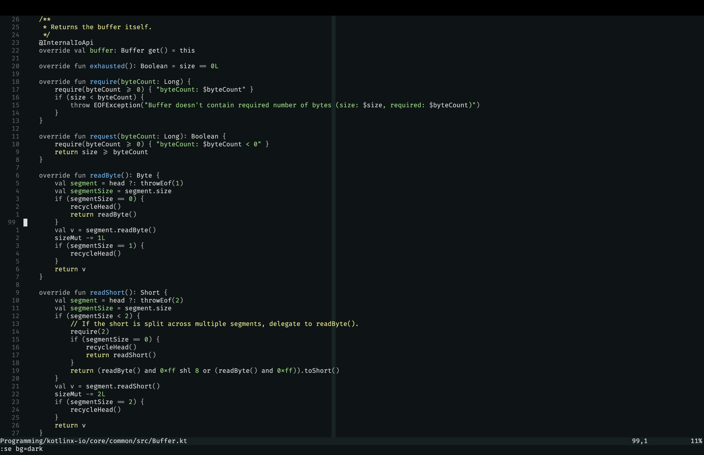
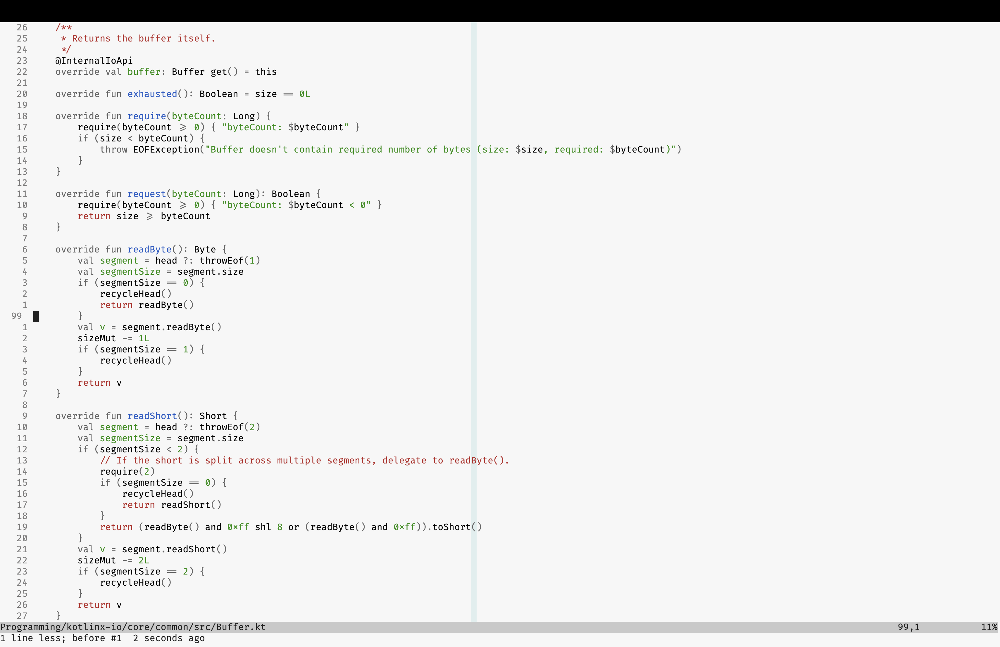

# y9nika.nvim

y9nika is my wife's nickname. This repo is a companion theme for my config at
[y9san9.nvim](https://github.com/y9san9/y9san9.nvim).

| Dark                        | Light                        |
| --------------------------- | ---------------------------- |
|  |  |

## Motivation

Most color schemes highlight everything they can, ending up looking like a
fireworks show. That's fine for most of the people and it feels fancy. But it
doesn't help to improve builtin human parser for stuff.

This colorscheme splits all the code into 3 categories:

* Declarations
* Statements
* Junk

This colorscheme only highlights declarations. There is no reason to highlight
statements since all the code is basically them. You will need to study them
one-by-one anyways. But when searching for a declaration with your eye,
highlighting might draw attention.

Only 3 classes of declarations are supported:

* Local
* Definition
* Comment

Locals are defined within scope and are not accessible once this scope is left.
The scope might be a function, loop, if condition or something else. Local
variables and constants are all highlighted using `@y9nika.variable`.

Definition is something that is defined within namespace and is attached to it,
rather than to scope. They are more important and therefore more noticeable.
Functions, classes, interfaces, global variables, it all falls under that
category and highlighted using `@y9nika.declaration`.

And comments are just... Comments. There is a trend to dim comments in nearly
every colorscheme. In my opinion if author of the original code wanted to say
you something, it should be noticeable. Perhaps that is the most important and
high-level information. It is highlighted using `@y9nika.marker`.

Additionally:

- y9nika.nvim reduces visibility of punctuation and standard language keywords
  (if, else, function, etc). They are usually least important and most obvious
  part of any program.

- y9nika.nvim doesn’t use font variations. It’s hard to scan code when it jumps
  between normal, **bold** and *italics* all the time. Also, not all fonts
  provide bold/italics variants.

- Having minimal amount of rules means you can consciously use them to look for
  the exact piece of information you need. Most other "fireworks" schemes
  provide only one meaningful contribution: if it’s colored it’s probably
  syntactically correct. Instead, in y9nika.nvim you can actually remember all
  the rules, and e.g. if you need to look for a string you know that you're
  looking for a green token. And all the strings really pop out because there
  are not many other things highlighted.

- y9nika.nvim only highlights things that parser could identify reliably. I
  believe that if highlighting works only partially then it does more harm than
  good. When highlighting works reliably, your brain learns to rely on it. When
  it’s not reliable, your brain spends precious brain cycles to re-check
  everything it sees on the screen.

## NOTE

This theme is heavily inspired by alabaster. Not just philosophy. The whole
implementation was taken from [this
repository](https://github.com/p00f/alabaster.nvim/). As of now y9nika.nvim has
some tweaks to the original theme that reduces amount of mental overhead when
working with code.

## Usage

```vim
set termguiclors
colorscheme y9nika
```

Supported languages:

- [x] Kotlin
- [x] Lua
- [x] VimScript
- [x] Markdown
- [x] Json
- [x] Git

Other languages have sensible defaults thanks to Neovim builtin queries, but
they might not be polished and something may be highlighted poorly.

## Configuration

No custom configuration is supported by design. It is an opinionated theme,
either make your fork or open an issue.

